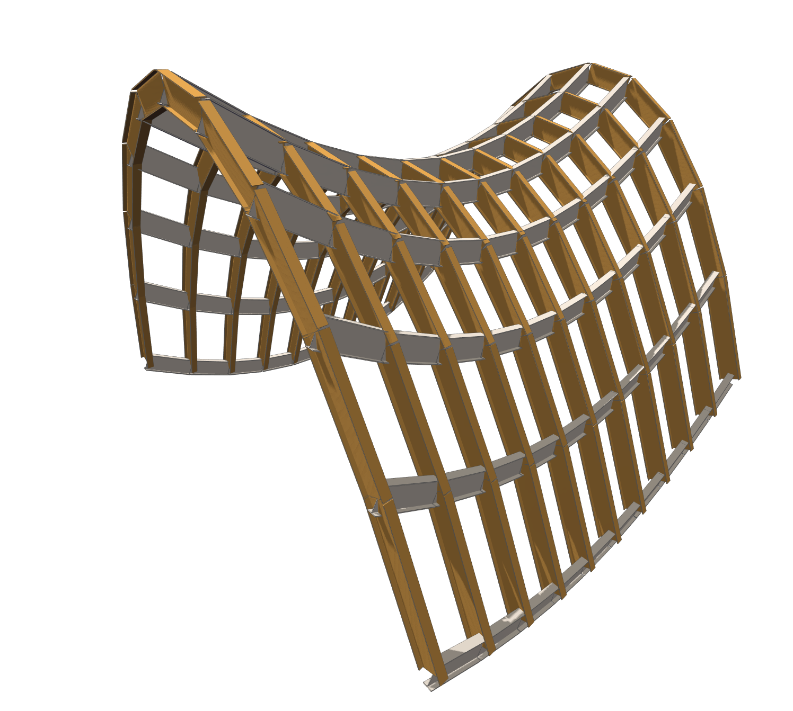

## Make Hypar

This function makes a hyperbolic paraboloid (hypar) surface from beams.

|Input|Description|
|----|----|
|X Amplitude|The amplitude in the x direction.|
|Y Amplitude|The amplitude in the y direction.|
|Divisions|The number of panel divisions|
 

|Output|Description|
|----|----|
|Maximum Beam Length|The maximum length of a beam.|
|Minimum Beam Length|The minimum length of a beam.|
|Minimum Elevation|The minimum elevation of any beam's center line vertices.|
|Maximum Elevation|The maximum elevation of any beam's center line vertices.|
